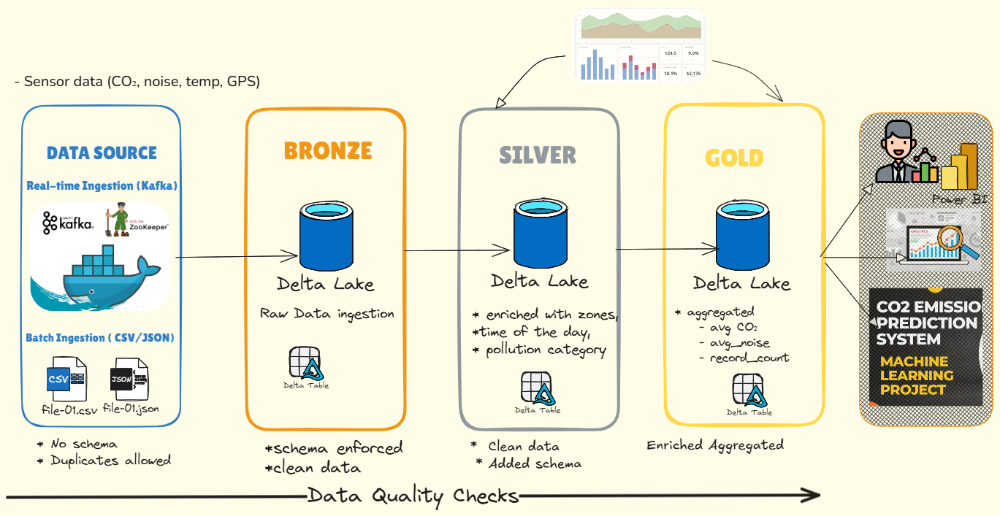

# Medallion Sensor Streaming

A streaming data pipeline that simulates sensor telemetry, lands raw events in a Delta Lake Bronze layer, enriches them into Silver, and aggregates to Gold for analytics and dashboards.

This repository is part of the broader Digital Twin Den Bosch backend. It integrates with the `digitaltwindenboschbackend` project and represents the streaming logic for UDT Den Bosch, developed by Daniel Wondyfiraw at DataTwinLabs. A cloud deployment version will be published next.

## Architecture


## What is included
- Kafka producer and consumer utilities for sensor events.
- Spark Structured Streaming jobs for Bronze, Silver, and Gold layers.
- A Streamlit dashboard for Silver/Gold visualizations.
- Utilities for clearing checkpoints and inspecting Delta tables.

## Project layout
- `streaming/kafka_producer.py` - sample Kafka producer for sensor events.
- `streaming/kafka_consumer.py` - Kafka stream reader helper for Spark.
- `streaming/mqttstream.py` - MQTT sensor simulator (optional data source).
- `scripts/kafka_to_bronze.py` - Kafka -> Bronze Delta streaming job.
- `scripts/bronze_to_silver.py` - Bronze -> Silver enrichment job.
- `scripts/silver_to_gold.py` - Silver -> Gold aggregation job.
- `scripts/spark_reader.py` - quick Delta table reader for debugging.
- `dashboard/dashboard_streamlit.py` - Streamlit dashboard for Silver/Gold.
- `clear_checkpoints.sh` - reset local Delta tables and checkpoints.

## Requirements
- Python 3.9+
- Apache Spark 3.5.x
- Delta Lake 3.0.x
- Kafka broker (default `localhost:9092`)
- Optional: MQTT broker (default `localhost:1883`), Streamlit

## Quick start (local)
1) Start Kafka and create the topic `sensor-data-medallion`.
2) Produce data to Kafka:
   ```bash
   python streaming/kafka_producer.py
   ```
3) Start Bronze ingestion:
   ```bash
   spark-submit \
     --packages org.apache.spark:spark-sql-kafka-0-10_2.12:3.5.0,io.delta:delta-spark_2.12:3.0.0 \
     --conf spark.sql.extensions=io.delta.sql.DeltaSparkSessionExtension \
     --conf spark.sql.catalog.spark_catalog=org.apache.spark.sql.delta.catalog.DeltaCatalog \
     scripts/kafka_to_bronze.py
   ```
4) Start Silver enrichment:
   ```bash
   spark-submit \
     --packages org.apache.spark:spark-sql-kafka-0-10_2.12:3.5.0,io.delta:delta-spark_2.12:3.0.0 \
     --conf spark.sql.extensions=io.delta.sql.DeltaSparkSessionExtension \
     --conf spark.sql.catalog.spark_catalog=org.apache.spark.sql.delta.catalog.DeltaCatalog \
     scripts/bronze_to_silver.py
   ```
5) Start Gold aggregation:
   ```bash
   spark-submit \
     --packages org.apache.spark:spark-sql-kafka-0-10_2.12:3.5.0,io.delta:delta-spark_2.12:3.0.0 \
     --conf spark.sql.extensions=io.delta.sql.DeltaSparkSessionExtension \
     --conf spark.sql.catalog.spark_catalog=org.apache.spark.sql.delta.catalog.DeltaCatalog \
     scripts/silver_to_gold.py
   ```
6) Optional: run the dashboard:
   ```bash
   streamlit run dashboard/dashboard_streamlit.py
   ```

## Notes
- The MQTT simulator publishes to `denbosch/sensors/air/<sensor_id>`. A bridge from MQTT to Kafka is not included here.
- Paths for Delta tables live under `data/bronze`, `data/silver`, and `data/gold`.
- Use `./clear_checkpoints.sh` to reset local state if needed.
- For production deployments, use isolated checkpoints per sensor domain and apply watermarks for domain-level aggregations to control state and late data.

## Related repositories
- `digitaltwindenboschbackend` - Core backend services for the Digital Twin Den Bosch platform. See: `https://github.com/dawondyifraw/digitaltwindenboschbackend`.

## License
See `LICENSE`.
